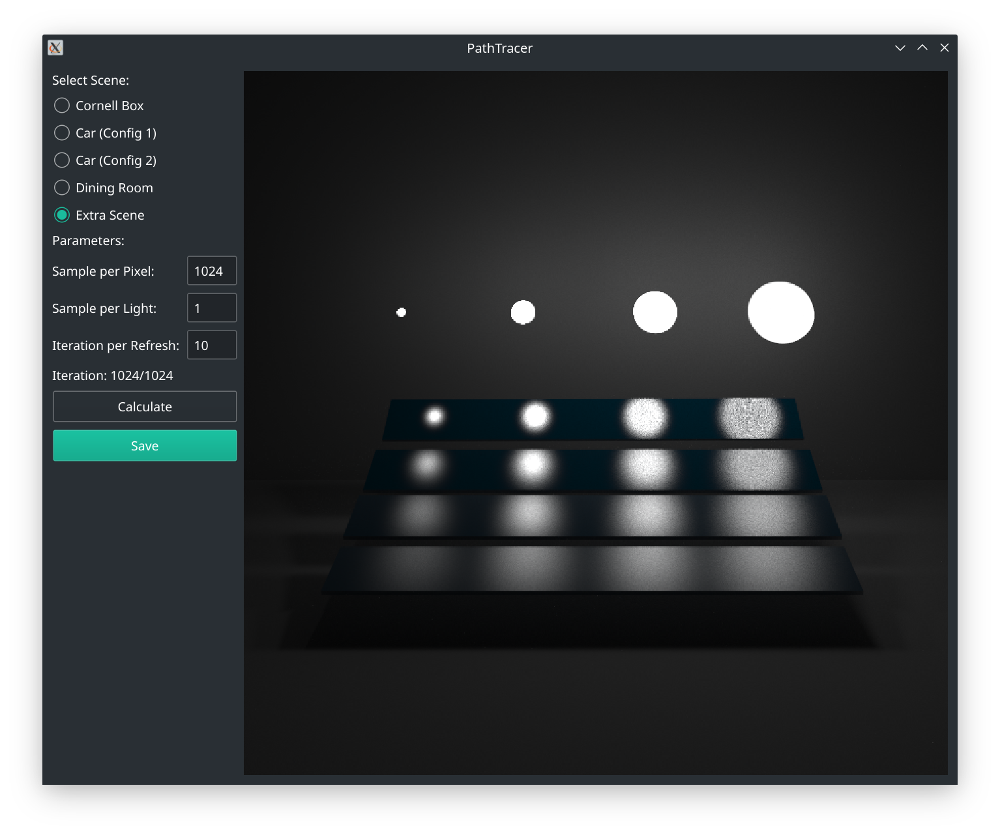
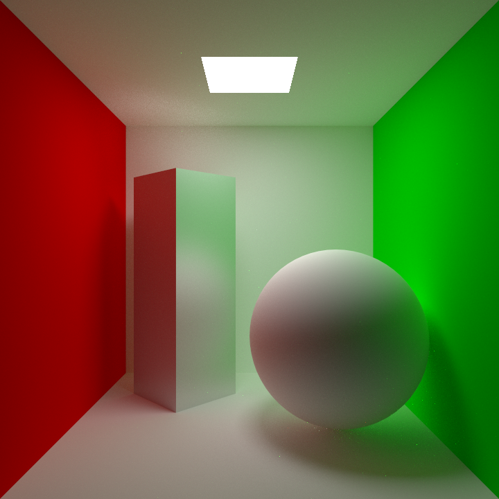
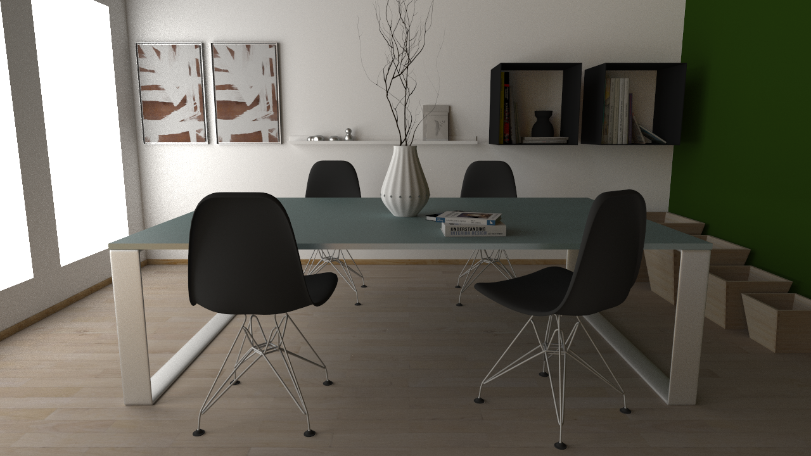
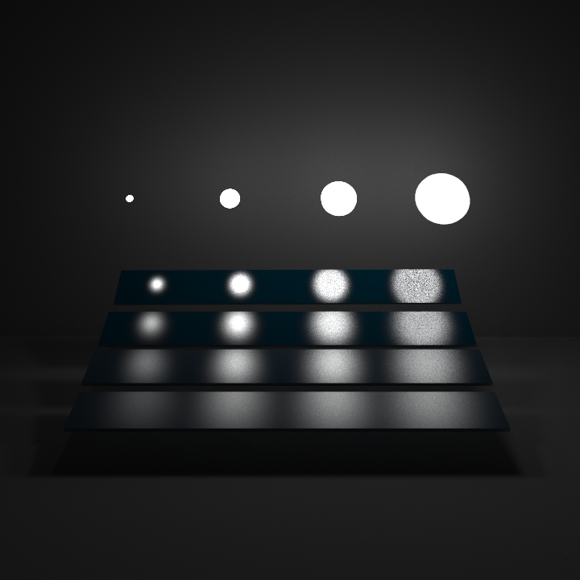

# PathTracer

## 简介

本程序实现了Monte Carlo路径追踪算法，并在实现中使用了下列技术。

- 使用BVH对光线与场景求交进行加速
- 分层采样
- 对光源采样
- 根据BRDF的重要性采样
- 俄罗斯轮盘
- 伽马校正

## 开发环境

本程序在Manjaro Linux操作系统下开发，使用的一些软件和库以及它们的版本如下表所示。

|软件/库|版本|
|:---:|:---:|
|Linux内核|5.11.6|
|GCC|10.2.0|
|CMake|c.19.7|
|Assimp|5.0.1|
|Qt|5.15.2|
|OpenMP|11.1.0|

其中Assimp用于场景以及材质、纹理的读取；Qt用于相关的向量计算，并且提供图形用户界面和显示绘制结果；OpenMP用于提供CPU级别的并行运算，从而提高程序运行效率。

## 使用说明

- 编译并运行程序后，可以通过界面上的单选框选择要绘制的场景。
- 通过界面上的文本框，可以设置一些绘制中使用的参数，它们的含义如下所示。
  - Sample per Pixel (SPP)：每个像素的采样数。
  - Sample per Light：每次递归时对每个光源的采样数。
  - Iteration per Refresh：每经过多少次迭代更新一次绘制结果。
- 设置完成后，点击Calculate按钮即可开始绘制，绘制结果会显示在设置选项右侧。
- 绘制完成后，可以点击Save按钮保存绘制结果。

## 运行截图

## 类说明

程序中的一些类及它们的说明如下表所示。

|类|说明|
|:---:|:---:|
|Point|点，包括点的位置、法向量、UV坐标|
|Triangle|三角形|
|AABB|座标轴对齐的包围盒|
|BVH|层次包围盒|
|Material|材质，包括漫反射系数、镜面反射系数等属性|
|Texture|纹理，并通过双向线性插值计算纹理颜色|
|Mesh|三角形网格，以及其对应的材质和纹理|
|Environment|环境贴图|
|Scene|整个场景，包括网格和环境贴图|
|Ray|光线|

# 运行结果

Cornell Box (SPP=4096)

")

Car (Config 1, SPP=1024)

")

Car (Config 2, SPP=1024)

Dining Room (SPP=1024)

Extra Scene (SPP=1024)

## 存在问题

- 镜面反射不明显，例如Car场景中车的表面和Dining Room场景中的椅子背面基本看不出镜面高光，与示例还有较大差距。
- 使用俄罗斯轮盘技术后，在Cornell Box场景中出现了较多亮度较高的噪点，即使将SPP设置为4096还是不能将其完全消除，经过测试，如果使用限制光线最大弹射次数的方法则不会出现这种问题。
