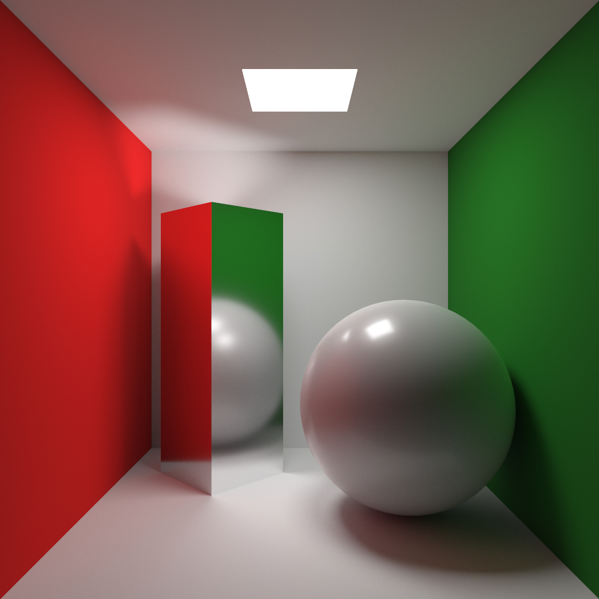
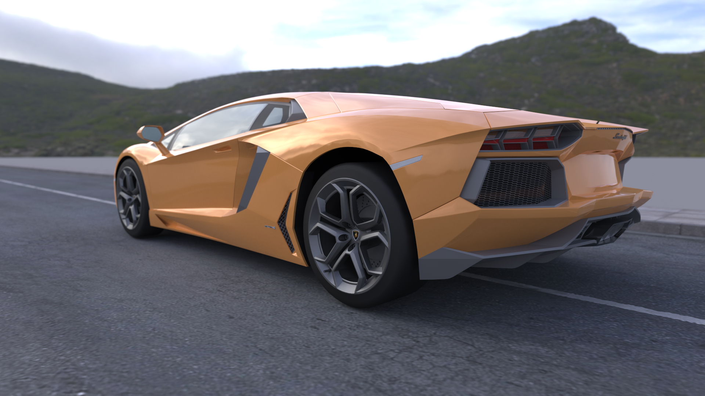
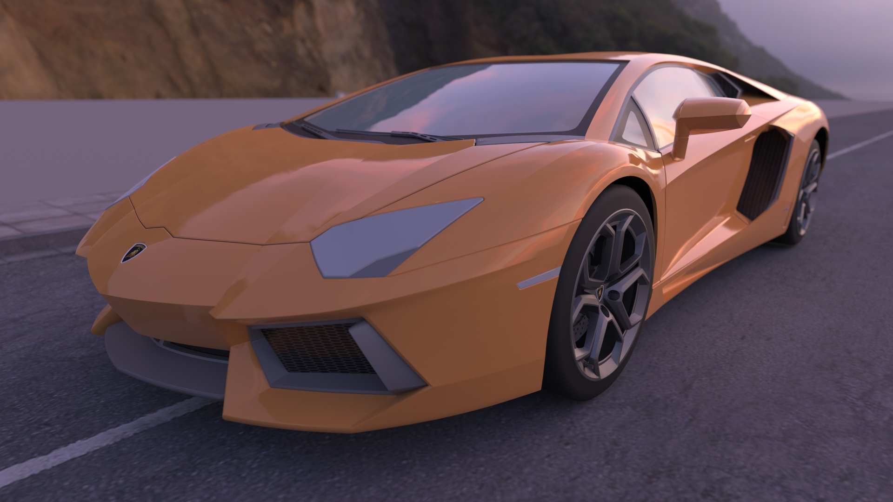
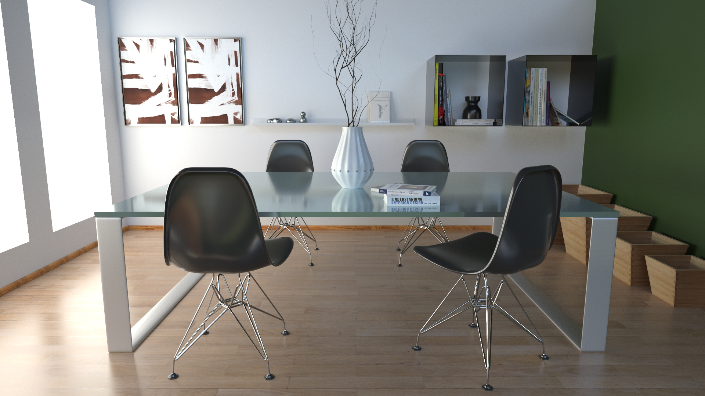

# Computer Graphics 2020 Winter

## Project Requirements
You are required to implement a simple **c++** realistic rendering engine using **Monte Carlo Path Tracing**. 

**Test your rendering algorithm with the following 3 specified scenes and more customed scenes that you create by yourself**. 

Some requirements and hints of this course project are listed below:
+ **Camera Config**: A standard pinhole camera is in **right-handed coordinate system** and can be defined using the following parameters:
    - *Position*:  The camera position is basically a vector in world space that points to the camera's position.
    - *LookAt*: The target point in world space that the camera face forward. So the forward *direction* vector as z-axis of camera can be calculated by normalizing *LookAt-Position*.
    - *Up*: The y-axis of camera.
    - *Fov*: Field-of-view,the view angle(in degree) on the y-axis of camera.
+ **Scene Geometry**: Scene geometries are also placed in **right-handed world coordinate system**. We use [.obj](https://en.wikipedia.org/wiki/Wavefront_.obj_file) file to store scene geometry data in **triangle mesh**. You can view or edit scene using [Maya](https://www.autodesk.com/products/maya/overview) or other tools.
Besides, you can implement other shapes like quad, sphere, box, cylinder for bonus.
+ **Material Description**: You are required to implement lambertian diffuse material and Glossy material. Other complex materials like glass and metal are bonus. 
    - *Lambertian Diffuse*: **kd** is the diffuse reflectance.
    - *Glossy*: Glossy material is a mixture of phong lobe and diffuse lobe. **kd** is the diffuse reflectance. **ks** is the specular reflectance, **Ns** is the exponent of phong lobe.
+ **Light**: Test scenes are illuminated by area light (diffuse emitter) and skybox (environment mapping). We use **Le** in .mtl to store the emittance of light source with "_light" as name suffix. We use .hdr image as skybox environment map. 
+ **Reference Rendering Result**: Your results may differ from the references image but it is acceptable as long as you correctly place the camera and show resonable results.
## 1. Cornell Box
This scene is illuminated by 1 area light.
### Camera Config
+ *Position*=vec3(0, 0, 2.5) 
+ *LookAt*=vec3(0,0,0)
+ *Up*=vec3(0, 1, 0)
+ *Fov*=60

### Reference Rendering Result

## 2. Car
This scene is illuminated by skybox. We provide 2 environment maps and 2 camera configs for testing:
### Camera Config 1
+ *Position*=vec3(8.22, -0.61, -9.80) 
+ *LookAt*=vec3( 7.514,   -0.702,   -9.097)
+ *Up*=vec3(-0.065,    0.996,    0.065)
+ *Fov*=45

### Camera Config 2
+ *Position*=vec3(5.72, 0.12, 9.55) 
+ *LookAt*=vec3( 5.085,   -0.131,    8.819)
+ *Up*=vec3( -0.165,    0.968,   -0.189)
+ *Fov*=45

### Reference Rendering Result

## 3. Dining room
This scene is illuminated by 3 area lights and skybox.
### Camera Config
+ *Position*=vec3( 0.000,   12.720,   31.850) 
+ *LookAt*=vec3( 0.000,   12.546,   30.865)
+ *Up*=vec3(0.000,    0.985,   -0.174)
+ *Fov*=45

### Reference Rendering Result

## Third Party Libraries
You are highly recommended to use the following third party libraries:
+ [**glm** for 3D math computations.](https://github.com/g-truc/glm)
+ [**tinyobj** for loading obj models.](https://github.com/syoyo/tinyobjloader)